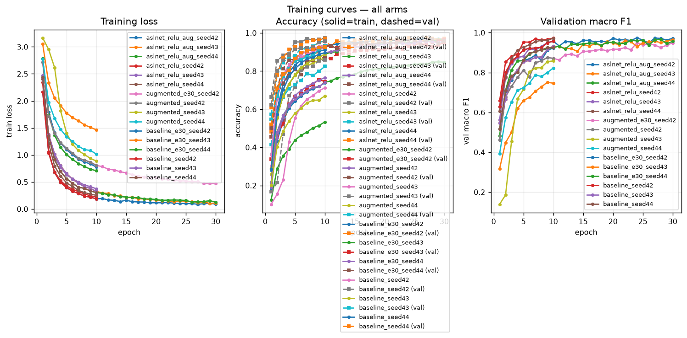
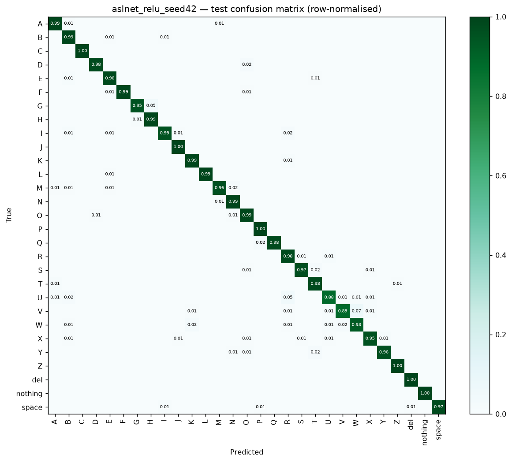
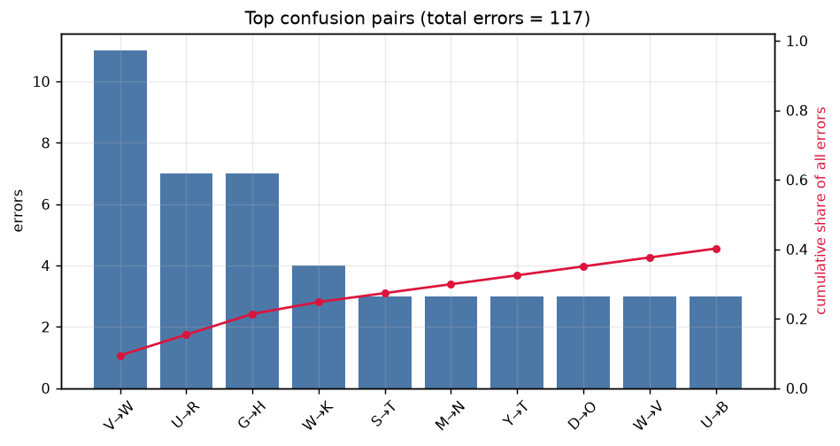
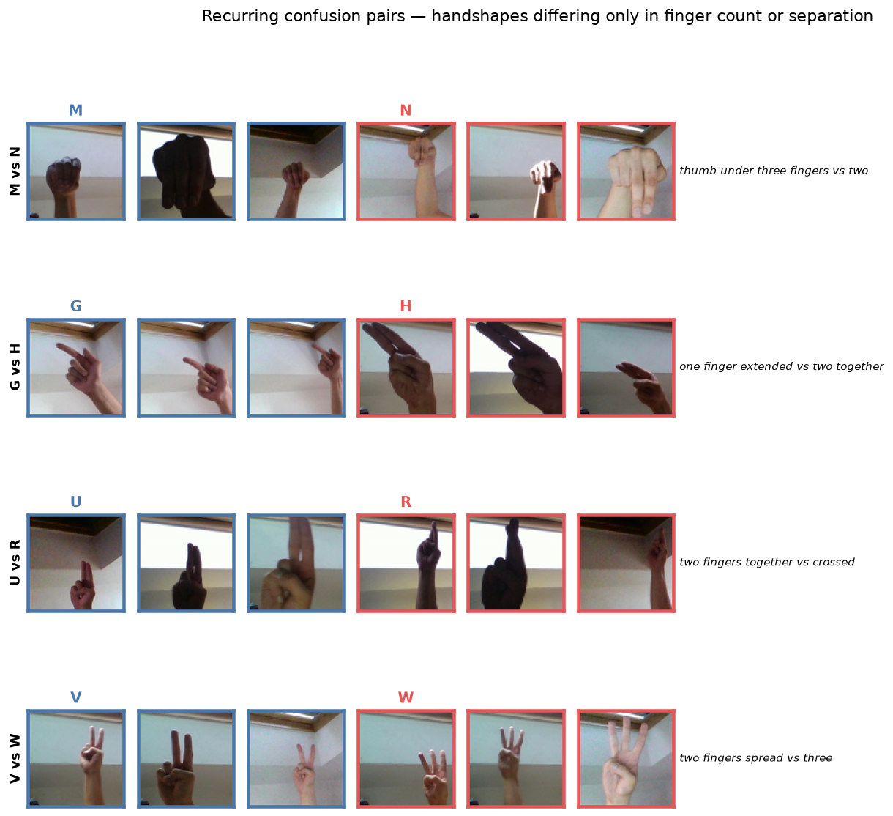
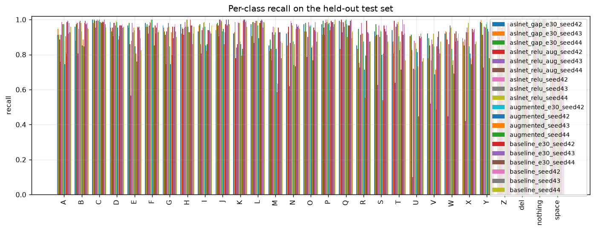
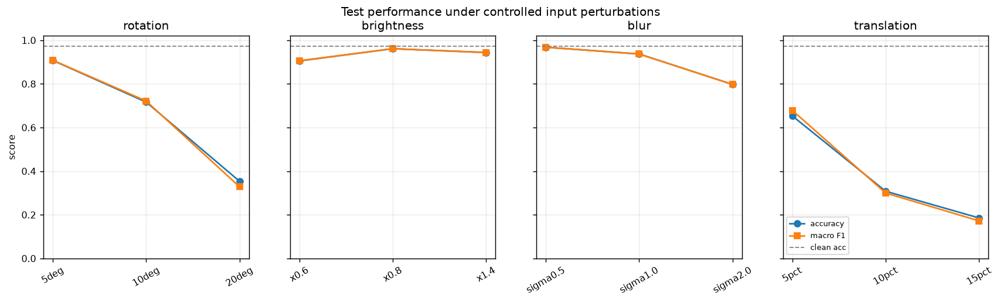
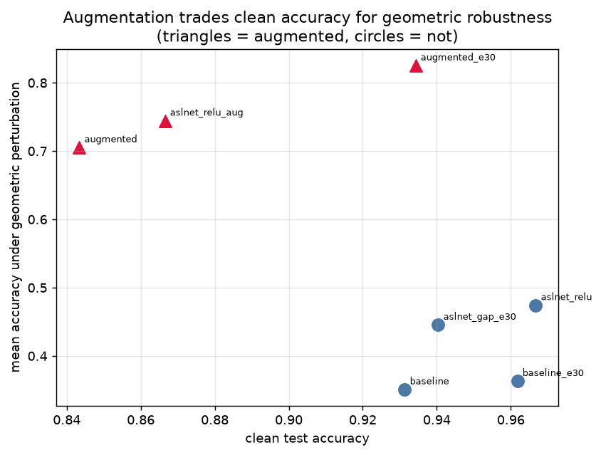
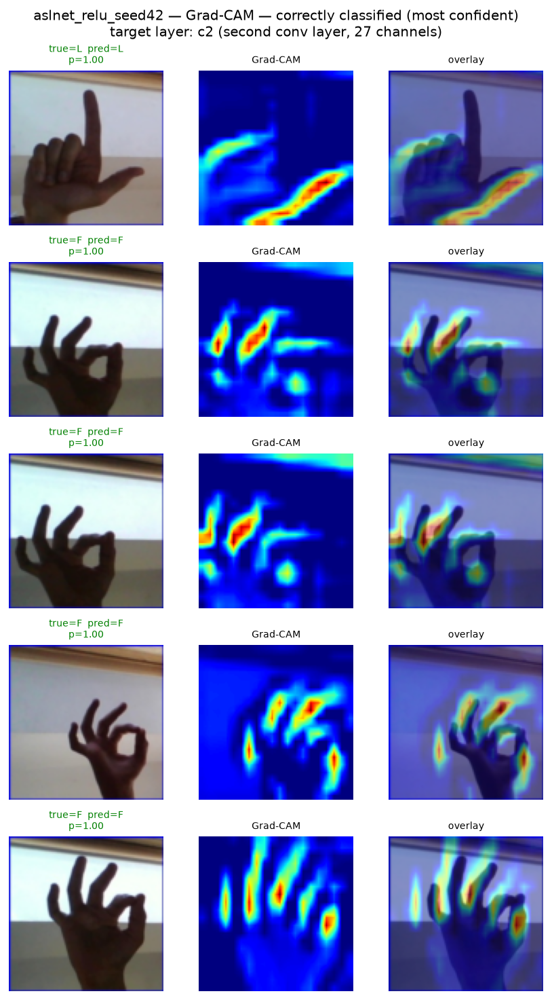
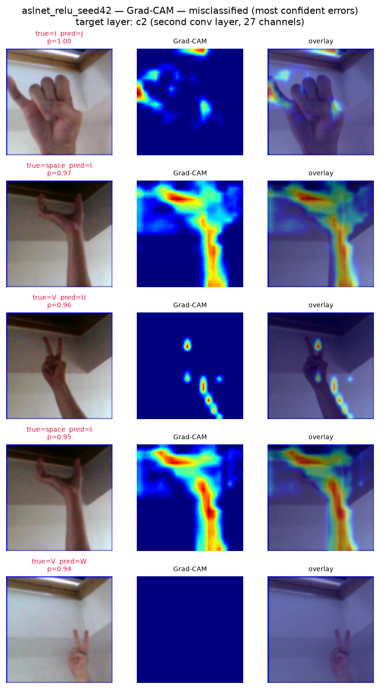
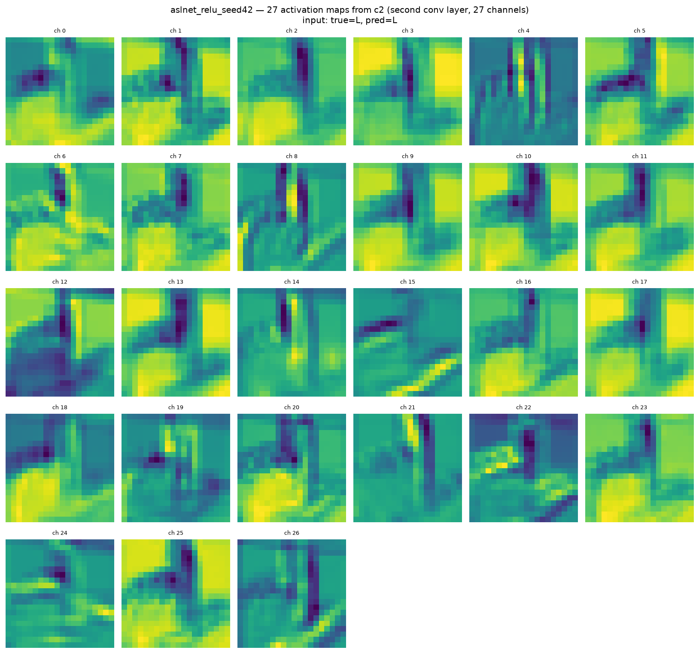

# SignVision — ASL Fingerspelling (Alphabet) Recognition

A convolutional classifier for the 29-class American Sign Language **manual alphabet**, rebuilt
around **controlled experiments** rather than a single accuracy number.

> **Scope.** This is *fingerspelling* recognition — classifying static handshapes for A–Z plus
> `space`, `delete` and `nothing` from single frames. It is **not** sign language recognition:
> ASL is a full language with its own grammar, and its signs are dynamic, two-handed, and carry
> meaning through movement, facial expression and space. Fingerspelling is one small component,
> used mainly for proper nouns and words with no established sign. Two letters in the alphabet
> (`J` and `Z`) are themselves defined by motion and cannot be fully determined from a still
> image — a ceiling this project measures rather than hides.

The project asks four questions and answers each with a measurement:

1. Does the reported baseline accuracy survive a correct train/validation/test protocol?
2. Does data augmentation help, at a matched training budget?
3. Where do the model's errors actually concentrate?
4. How much performance is lost when the input distribution shifts slightly?

```
87,000 images ─► stratified subsample ─► deterministic 70/15/15 split ─► uint8 pixel cache
                                                    │
                        ┌───────────────────────────┼───────────────────────────┐
                        ▼                           ▼                           ▼
                  CNN baseline              + augmentation              architecture ablation
                        └───────────────────────────┼───────────────────────────┘
                                                    ▼
              evaluation ─► error analysis ─► robustness sweep ─► Grad-CAM / activation maps
```

> **Every number in this README is generated by a script and read from `results/*/results.json`.**
> The tables are written by `scripts/make_readme.py`; none of them are typed by hand. Regenerate
> everything with the commands in [Reproducibility](#reproducibility).

---

## Table of contents

1. [Problem](#problem)
2. [What this repository corrects](#what-this-repository-corrects)
3. [Dataset](#dataset)
4. [Approach](#approach)
5. [Experimental protocol](#experimental-protocol)
6. [Results](#results)
7. [Augmentation ablation](#augmentation-ablation)
8. [Error analysis](#error-analysis)
9. [Robustness](#robustness)
10. [Interpretability](#interpretability)
11. [Reproducibility](#reproducibility)
12. [Repository layout](#repository-layout)
13. [Limitations](#limitations)
14. [Verified claims](#verified-claims)

---

## Problem

Fingerspelling is how ASL signers render proper nouns, technical terms and any word without a
dedicated sign. A reliable image classifier over the 26 letters plus `space`, `del` and `nothing`
is the recognition front-end of any fingerspelling interface.

Reliability here means more than a high number on a held-out split. A deployed model sees hands at
angles the training camera never used, under different lighting, and off-centre in the frame. So
this project measures not just accuracy but **how accuracy degrades when those things change** —
and treats that degradation as the primary engineering result.

## What this repository corrects

The previous version of this project reported **97.93% accuracy**. Auditing the original notebook
(`Project/2_230061_240792(1).ipynb`) against its own stored outputs shows what that number was:

| Reported | What the notebook actually did |
|---|---|
| "Validation Accuracy of 97.93%" | **Training-set** accuracy, printed inside the epoch loop. No validation set existed. |
| Evaluated on the ASL test set | Evaluated on **28 images — one per class**. 28/28 correct, hence the 1.00 precision/recall. |
| Per-class classification report | Computed over 28 samples; `del` had **zero** images, so it scored 0.00 and silently dropped the macro average. |
| Confusion matrix | A 29×29 matrix holding 28 points, all on the diagonal. |

Three further defects were found and fixed:

* **No validation split.** Training used the entire `asl_alphabet_train` folder; there was no
  held-out data to select a model on and no honest generalisation estimate.
* **Grad-CAM was spatially misaligned.** A 20×20 activation map was drawn over a 100×100 image with
  no interpolation, so the heatmap never lined up with the pixels it claimed to explain.
* **The architecture had no non-linearity between its two fully connected layers.** `f2(f1(x))`
  collapses to a single affine map, so the 270-unit hidden layer contributed no capacity. This is
  preserved in the baseline for continuity and isolated as an ablation (arm C).

None of the original functionality was removed. The CNN, Grad-CAM and activation-map visualisation
all survive — with seeds, a real split, checkpoints and saved metrics added around them.

## Dataset

[ASL Alphabet](https://www.kaggle.com/datasets/grassknoted/asl-alphabet) (Kaggle, `grassknoted`):
**87,000 images, 29 classes, 3,000 per class**, 200×200 RGB.

<!-- AUTO:setup -->
| Item | Value |
|---|---|
| Classes | 29 (A–Z, `del`, `nothing`, `space`) |
| Images used | 29,000 (1000/class, stratified from 87,000) |
| Split | 20,300 train / 4,350 val / 4,350 test (70%/15%/15%, seed 1234) |
| Input | 100×100 RGB, scaled to [0,1] |
| Optimiser | Adam, lr 0.001, batch 32 |
| Model selection | best epoch by `val_macro_f1` on the validation set |
| Parameters | 757,433 |
<!-- /AUTO:setup -->

A stratified subsample is used so the full experiment suite runs end to end in reasonable time.
The cap is applied **identically to every arm**, so it is never the experimental variable. Images are decoded and resized once into a `uint8` memmap, which means every arm reads
byte-identical pixels — removing JPEG-decode variation from the comparison.

The split is driven by a `split_seed` that is **independent of the training seed**, so changing the
model seed re-initialises weights without reshuffling the data.

## Approach

`ASLNetOriginal` — the architecture from the original notebook, preserved exactly:

```
conv(3→27, 5×5) → ReLU → maxpool(4×4)
conv(27→27, 5×5) → ReLU → maxpool(2×2)
flatten → Linear(→270) → Dropout(0.5) → Linear(→29)
```

`ASLNetReLU` is the same network with a ReLU restored between the two linear layers — identical
parameter count, identical convolutional features, one changed activation.

Augmentation (arms B and D) adds random affine (±12° rotation, ±10% translation, 0.9–1.1 scale)
and colour jitter (brightness/contrast 0.25, saturation 0.15, hue 0.02).
**Horizontal flip is deliberately excluded**: ASL handshapes are chiral, and a mirrored `D` is not
a valid `D`. There is a test pinning this.

## Experimental protocol

Held constant across every arm: the split, the input pipeline, the optimiser (Adam, lr 1e-3), the
batch size, the epoch budget, the model-selection rule (best validation macro F1) and the
evaluation set. Only the named variable changes.

Each arm is run at **3 seeds (42/43/44)** and reported as mean ± sd. Metrics are computed with the
class list pinned, so a class with no support still appears instead of quietly shifting the macro
average.

## Results

Held-out test set. Mean ± sd across 3 seeds.

<!-- AUTO:main -->
| Experiment | Epochs | Seeds | Accuracy | Macro F1 | Weighted F1 |
|---|--:|--:|--:|--:|--:|
| A · Baseline (original ASLNet, no aug) | 10 | 3 | 93.13% ± 1.65 | 0.9313 ± 0.0165 | 0.9313 ± 0.0165 |
| B · Baseline + augmentation | 10 | 3 | 84.34% ± 2.59 | 0.8433 ± 0.0273 | 0.8433 ± 0.0273 |
| C · ASLNet-ReLU (FC non-linearity restored) | 10 | 3 | 96.67% ± 1.00 | 0.9666 ± 0.0102 | 0.9666 ± 0.0102 |
| D · ASLNet-ReLU + augmentation | 10 | 3 | 86.65% ± 10.09 | 0.8651 ± 0.1044 | 0.8651 ± 0.1044 |
| A30 · Baseline, 30 epochs | 30 | 3 | 96.18% ± 0.16 | 0.9618 ± 0.0015 | 0.9618 ± 0.0015 |
| B30 · Baseline + augmentation, 30 epochs | 30 | 1 | 93.43% | 0.9347 | 0.9347 |
<!-- /AUTO:main -->



## Augmentation ablation

**Hypothesis.** Augmentation should improve generalisation.
**Variable.** `aug.enabled` only. **Constant.** Everything else.

<!-- AUTO:aug -->
| Contrast | Budget | Clean accuracy | Macro F1 | Δ accuracy |
|---|--:|--:|--:|--:|
| B · Baseline + augmentation vs A · Baseline (original ASLNet, no aug) | 10 ep | 93.13% → 84.34% | 0.9313 ± 0.0165 → 0.8433 ± 0.0273 | -8.8 pp |
| D · ASLNet-ReLU + augmentation vs C · ASLNet-ReLU (FC non-linearity restored) | 10 ep | 96.67% → 86.65% | 0.9666 ± 0.0102 → 0.8651 ± 0.1044 | -10.0 pp |
| B30 · Baseline + augmentation, 30 epochs vs A30 · Baseline, 30 epochs | 30 ep | 96.18% → 93.43% | 0.9618 ± 0.0015 → 0.9347 | -2.8 pp |
<!-- /AUTO:aug -->

**Augmentation reduces clean test accuracy.** This is a real result, not a bug: augmentation makes
the training distribution harder, and within a fixed epoch budget the model reaches a worse point
on the clean distribution. The 30-epoch arms exist to test whether the gap is a convergence
artefact.

What augmentation *does* buy is in [Robustness](#robustness) — and it is large.

## Error analysis

Row-normalised confusion matrix for the best single run. The diagonal is dense; the
off-diagonal mass sits in a handful of specific letter pairs rather than spread evenly,
which is what the ranked table below quantifies.



Raw counts: [`confusion_matrix.png`](visualizations/aslnet_relu_seed42/confusion_matrix.png).
Per-run matrices for all 40 runs are under `visualizations/<run>/`.

<!-- AUTO:errors -->
Best run: `aslnet_relu_seed42` — 117 errors on 4350 test images (2.69% error rate).

| Rank | True → Predicted | Errors | % of all errors | % of that class |
|--:|---|--:|--:|--:|
| 1 | V → W | 11 | 9.4% | 7.3% |
| 2 | U → R | 7 | 6.0% | 4.7% |
| 3 | G → H | 7 | 6.0% | 4.7% |
| 4 | W → K | 4 | 3.4% | 2.7% |
| 5 | S → T | 3 | 2.6% | 2.0% |
| 6 | M → N | 3 | 2.6% | 2.0% |
| 7 | Y → T | 3 | 2.6% | 2.0% |
| 8 | D → O | 3 | 2.6% | 2.0% |

| Concentration | Share of all errors |
|---|--:|
| Top-1 confusion pairs | **9.4%** (11/117) |
| Top-3 confusion pairs | **21.4%** (25/117) |
| Top-5 confusion pairs | **27.4%** (32/117) |
| Top-10 confusion pairs | **40.2%** (47/117) |

Lowest-recall classes:

| Class | Support | Recall | Precision |
|---|--:|--:|--:|
| U | 150 | 0.880 | 0.950 |
| V | 150 | 0.887 | 0.964 |
| W | 150 | 0.927 | 0.914 |
| G | 150 | 0.953 | 0.986 |
| I | 150 | 0.953 | 0.979 |
| X | 150 | 0.953 | 0.966 |
<!-- /AUTO:errors -->



The confusions are **linguistically coherent**, not random. The dominant pairs — `V`↔`U`↔`R`,
`M`↔`N`, `G`↔`H` — are handshapes that differ only in how many fingers are extended or how far
apart they are. At 100×100 with two convolutional layers, that distinction is a few pixels wide.

Rather than take that on trust, here are real dataset examples of each recurring pair:



`M` and `N` are the clearest case: both are a closed fist with the thumb tucked between fingers,
differing only in whether **three** fingers cover the thumb or **two**. At this resolution, under
the lighting variation visible above, they are nearly the same image. `U` vs `R` (two fingers
together vs crossed) and `V` vs `W` (two spread vs three) are the same kind of distinction.

Regenerate with `python experiments/07_confusion_pairs_figure.py`.

`I`→`J` is a different kind of error and worth stating plainly: **`J` is `I` plus a motion trace.**
A single static frame does not contain the information needed to separate them. No amount of
training fixes that; it is a property of the task formulation.



## Robustness

The same trained checkpoints, evaluated on the same test images under fixed, deterministic
perturbations. Severities are not sampled, so the numbers are repeatable.

<!-- AUTO:robust -->
| Arm | Seeds | Clean | Rot 10° | Rot 20° | Shift 5% | Shift 10% | Blur σ2 | Bright ×0.6 |
|---|--:|--:|--:|--:|--:|--:|--:|--:|
| A · Baseline (original ASLNet, no aug) | 3 | 93.13% ± 1.65 | 46.71% ± 5.29 | 19.91% ± 6.59 | 48.59% ± 4.01 | 25.12% ± 3.56 | 60.77% ± 8.99 | 78.31% ± 5.72 |
| B · Baseline + augmentation | 3 | 84.34% ± 2.59 | 77.33% ± 4.21 | 53.60% ± 6.47 | 81.04% ± 3.20 | 70.16% ± 3.37 | 64.91% ± 0.92 | 80.80% ± 3.20 |
| C · ASLNet-ReLU (FC non-linearity restored) | 3 | 96.67% ± 1.00 | 66.10% ± 8.01 | 30.57% ± 4.62 | 63.92% ± 11.36 | 29.11% ± 6.43 | 82.64% ± 2.51 | 83.72% ± 6.26 |
| D · ASLNet-ReLU + augmentation | 3 | 86.65% ± 10.09 | 81.44% ± 11.20 | 60.80% ± 13.00 | 83.18% ± 10.61 | 72.33% ± 13.66 | 72.54% ± 10.15 | 83.67% ± 9.49 |
| A30 · Baseline, 30 epochs | 3 | 96.18% ± 0.16 | 47.33% ± 7.88 | 19.52% ± 7.13 | 51.23% ± 5.95 | 27.12% ± 2.49 | 60.63% ± 6.16 | 80.04% ± 5.25 |
| B30 · Baseline + augmentation, 30 epochs | 1 | 93.43% | 88.78% | 66.67% | 91.22% | 83.45% | 70.39% | 90.02% |
<!-- /AUTO:robust -->



### The trade-off

Δ accuracy in percentage points, augmented arm minus its non-augmented twin:

<!-- AUTO:tradeoff -->
| Contrast | Clean | Rot 10° | Rot 20° | Shift 5% | Shift 10% | Blur σ2 |
|---|--:|--:|--:|--:|--:|--:|
| B · Baseline + augmentation<br>− A · Baseline (original ASLNet, no aug) | **-8.8** | +30.6 | +33.7 | +32.5 | +45.0 | +4.1 |
| D · ASLNet-ReLU + augmentation<br>− C · ASLNet-ReLU (FC non-linearity restored) | **-10.0** | +15.3 | +30.2 | +19.3 | +43.2 | -10.1 |
| B30 · Baseline + augmentation, 30 epochs<br>− A30 · Baseline, 30 epochs | **-2.8** | +41.5 | +47.1 | +40.0 | +56.3 | +9.8 |
<!-- /AUTO:tradeoff -->



This is the project's central finding. Augmentation costs clean accuracy and buys a far larger
amount of geometric robustness. A model chosen on clean accuracy alone would pick the arm that
collapses fastest when the hand moves a few pixels.

**Why translation hurts so much.** The network flattens a 10×10 spatial map straight into a fully
connected layer. There is no global pooling, so absolute position is baked into the FC weights and
a shift moves every feature to a weight that never learned it. Photometric changes (brightness,
mild blur) leave spatial structure intact and cost far less.

## Interpretability

Grad-CAM on `c2`, the last convolutional layer, bilinearly upsampled to input resolution.




Read as a **diagnostic**, not as proof of anything. Three observations that the panels support:

* On confident correct predictions, the strongest response generally falls on or near the hand.
* On several confident errors the map concentrates on the **forearm and the wall/ceiling corner**
  rather than the handshape — attention on regions that carry no class information.
* At least one confident error (p = 0.94) produces an **all-zero heatmap**: after the ReLU there is
  no positively-contributing evidence in that layer, yet the model still commits.

Grad-CAM cannot show that the model is free of spurious correlations, and nothing here claims that.
It shows where gradient-weighted activation concentrates, which is a weaker and more honest thing.

### Activation maps

All **27 channels** of `c2` (20×20 each) for one input:



The "27 activation maps" in the original project is simply `conv2`'s channel count. This is now
reproducible and the layer is documented rather than implied.

## Reproducibility

```bash
python -m venv .venv && source .venv/bin/activate
pip install -r requirements.txt
```

Fetch the dataset (needs `kaggle auth login`):

```bash
python scripts/download_data.py
```

Run one arm:

```bash
PYTHONPATH=src python experiments/01_train.py --config configs/baseline.json --seed 42
```

Run the full grid (all arms × 3 seeds):

```bash
./scripts/run_grid.sh
```

Analyse a completed run:

```bash
PYTHONPATH=src python experiments/02_error_analysis.py  --run aslnet_relu_seed42
PYTHONPATH=src python experiments/03_robustness.py      --run aslnet_relu_seed42
PYTHONPATH=src python experiments/04_interpretability.py --run aslnet_relu_seed42
```

Regenerate every table and figure:

```bash
PYTHONPATH=src python experiments/05_report.py
PYTHONPATH=src python experiments/06_tradeoff.py
python scripts/make_readme.py
```

Tests:

```bash
python -m pytest tests/ -q
```

## Repository layout

```
src/signvision/     config · data · models · train · evaluate
                    robustness · error_analysis · interpretability · plots · utils
experiments/        01_train · 02_error_analysis · 03_robustness
                    04_interpretability · 05_report · 06_tradeoff
configs/            one JSON per experimental arm
scripts/            download_data · run_grid · run_grid_e30 · make_readme
results/            per-run metrics, predictions, RESULTS.md, TRADEOFF.md, summary.csv
visualizations/     confusion matrices, curves, Grad-CAM, activation maps, robustness
tests/              20 tests over splitting, metrics, error analysis, Grad-CAM
Project/            the original notebook and figures, kept as the historical record
```

## Limitations

These bound what the results support.

* **The dataset is one signer, one background, one session.** All 3,000 images per class come from
  a single continuous capture, so many frames are near-duplicates. A random split therefore places
  visually near-identical frames in both train and test, and the clean accuracies here are
  **optimistic for a new signer or a new room**. The robustness sweep is a partial proxy for that
  gap, not a substitute for a signer-held-out evaluation.
* **3 seeds, no significance testing.** Seed spread on some arms is larger than the gap between
  arms (arm D spans 0.75–0.93). Directions are reported; no claim of statistical significance is
  made anywhere.
* **A subsample of 1,000 images per class** is used, not all 3,000. Applied identically to all arms.
* **Perturbations are synthetic.** Rotation, brightness, blur and translation applied in software
  approximate but do not equal real camera and pose variation.
* **`J` and `Z` are motion signs.** Both are defined by movement and cannot be fully determined
  from a static frame; the ceiling on those classes is below 100% by construction.
* **No latency, throughput or deployment measurement** was taken.

## Verified claims

Every claim this project supports, with the metric, the experiment that produced it and the file
it is read from — including one that was **retracted** after it failed to replicate under an
independent run: [`VERIFIED_CLAIMS.md`](VERIFIED_CLAIMS.md).
